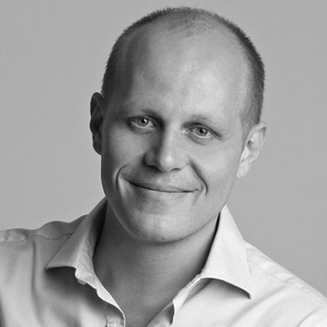
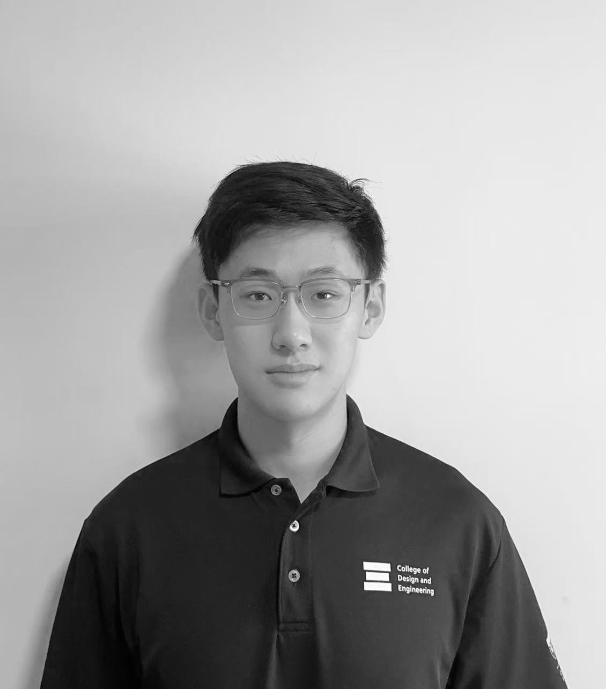
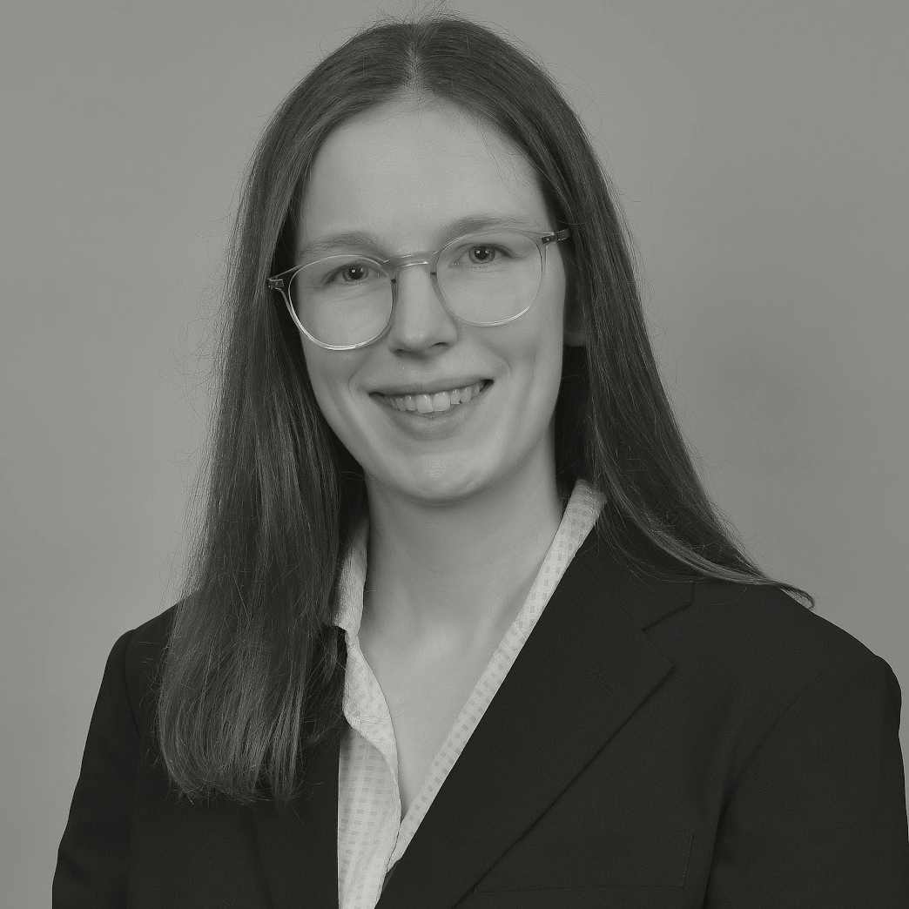
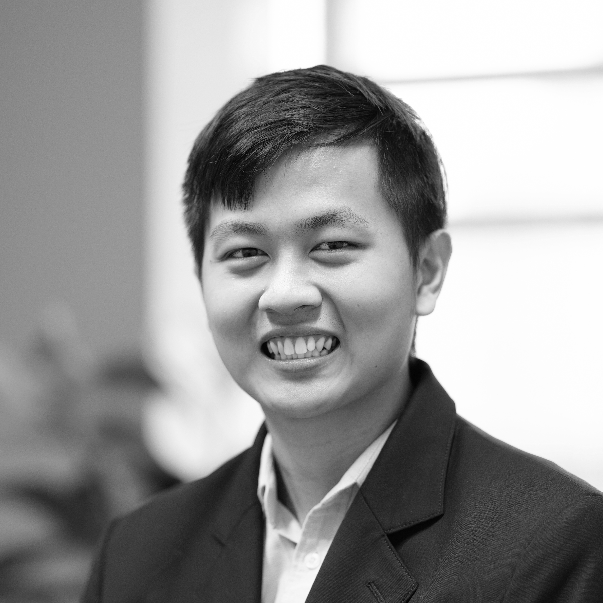
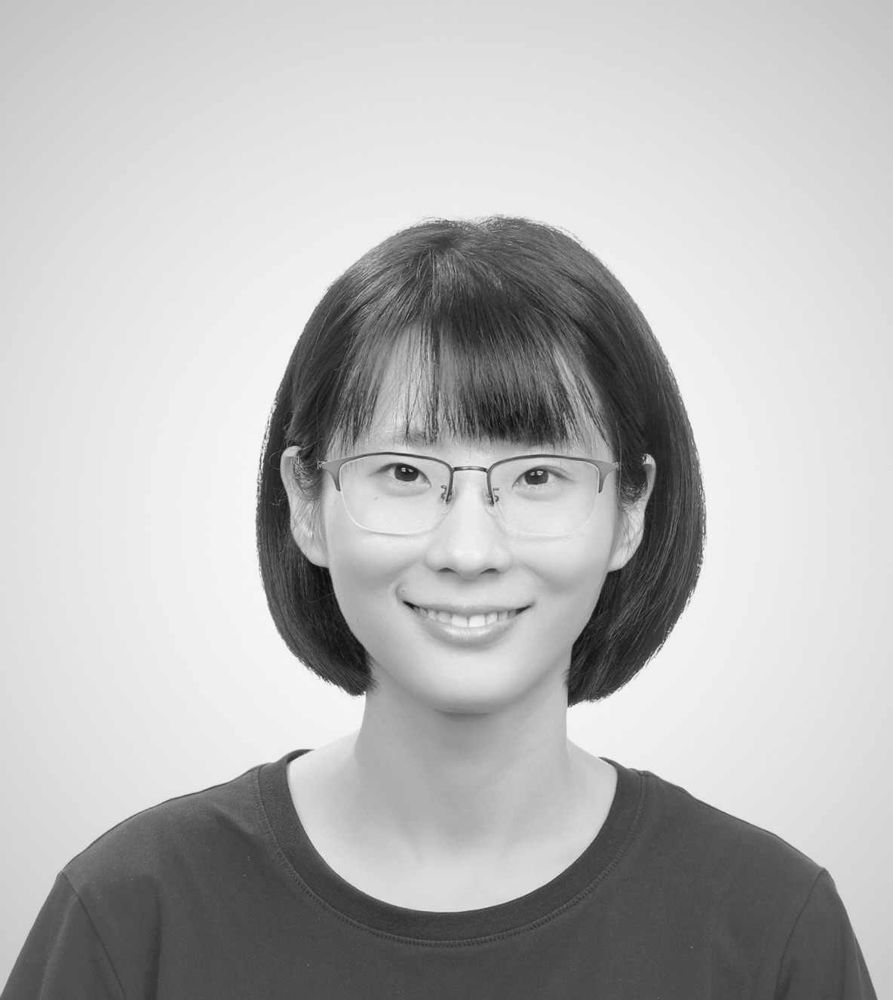

# Principal Investigator

  

    
    <h2>Gianmarco Mengaldo</h2>
    
Principal Investigator

    

      
Dr Gianmarco Mengaldo is an Assistant Professor in the Department of Mechanical Engineering at the National University of Singapore and an Honorary Research Fellow at Imperial College London. He received his BSc and MSc in Aerospace Engineering from Politecnico di Milano and his PhD in Aeronautical Engineering from Imperial College London, and has held roles at ECMWF, Caltech, and KBW. His research adopts an interdisciplinary approach combining mathematics and computational engineering, with current interests in explainable AI, AI and domain knowledge, coherent pattern identification, and high-fidelity multiphysics simulation across engineering, geophysics, healthcare, and finance.

    

  

# Research Fellows

  

    
    <h2>Luwei Xiao</h2>
    
Research Fellow

    

      
Luwei Xiao, Ph.D. is a Research Fellow at the National University of Singapore. He obtained his Ph.D. from East China Normal University, where his research focused on AI for Climate, Multimodal Learning, Affective Computing, and LLMs. Dr. Xiao has published over ten papers in leading international journals and conferences, including two ESI Highly Cited Papers. He led the Excellent Doctoral Student Academic Innovation Project at ECNU and has contributed to several major research initiatives, including the NSFC Young Scientist Fund, Shanghai Science and Technology Commission projects, and collaborations with Huawei Noah's Ark Lab.

    

  

# PhD Students

  

    
    <h2>Bayan Abusalameh</h2>
    
PhD Student

    

      
Bayan Abusalameh is a PhD student in the Department of Mechanical Engineering at the National University of Singapore, supervised by Prof. Gianmarco Mengaldo. Her research focuses on the intersection of deep learning and physical systems, especially identifying nonlinear dynamics with machine learning, with interests in geometric explainable AI, neural manifold interpretability, and human-aligned model representations. Before NUS, she was a PhD researcher at Imperial College London and worked as a Mechanical Engineer at NVIDIA.

    

  

  

    
    <h2>Chenyu Dong</h2>
    
PhD Student

    

      
Chenyu Dong is a Ph.D. candidate at the National University of Singapore (NUS), supervised by Prof. Gianmarco Mengaldo. His research focuses on the dynamics and predictability of extreme events in the climate system, especially the interaction between large-scale atmospheric circulation patterns and regional climate extremes, combining dynamical systems theory with AI-based approaches for regional weather forecasting and model explainability to improve predictive skill and physical interpretability in weather and climate applications.

    

  

  

    
    <h2>Emma Andrews</h2>
    
PhD Student

    

      
Emma Andrews is a PhD student in MathExLab at the National University of Singapore, supervised by Prof. Gianmarco Mengaldo. Her research focuses on measuring and developing more explainable AI for high-stakes domains, with a particular interest in applying XAI to natural language processing and time-series in order to build explainable forecasting models for AI4Science, climate, and geopolitics.

    

  

  

    
    <h2>Jiawen Wei</h2>
    
PhD Student

    

      
Jiawen Wei is a PhD student in the Department of Mechanical Engineering at National University of Singapore, advised by Prof. Gianmarco Mengaldo. Her current research interests include explainable AI and its evaluation, particularly the robustness of feature attribution methods, adversarial machine learning guided by sample importance interpretation, foundation models for time series, and explainable AI methods for scientific domains with a focus on extreme events.

    

  

  

    
    <h2>Keane Ong</h2>
    
PhD Student

    

      
Keane Ong is a PhD candidate at the National University of Singapore, advised by Gianmarco Mengaldo (NUS), Erik Cambria (NTU), and Paul Liang (MIT). His research focuses on socially intelligent AI: systems that can understand, reason about, and respond to human behaviors, intentions, and social signals in a grounded and explainable manner. He works on benchmarks, learning methods, and multimodal foundation models, and studies climate and finance as real-world test beds for narrative understanding and strategic communication.

    

  

  

    
    <h2>Leonardo Pesce</h2>
    
PhD Student

    

      
Leonardo Pesce is a PhD student in the Department of Mechanical Engineering at the National University of Singapore, advised by Prof. Gianmarco Mengaldo. His research focuses on explainable artificial intelligence, especially methods for extracting human-aligned explanations and using them to improve the performance, accuracy, and robustness of machine learning models across domains such as LLMs, foundation models, reinforcement learning, climate, weather forecasting, and robotics.

    

  

  

    
    <h2>Zhou FANG</h2>
    
PhD Student

    

      
Zhou FANG is a Ph.D. candidate at the National University of Singapore (NUS), supervised by Prof. Gianmarco Mengaldo. Her research lies at the intersection of dynamical systems theory and machine learning, with a focus on scientific machine learning for modeling and forecasting complex dynamical systems. She studies how dynamical systems principles can be used to evaluate, interpret, and improve machine learning models, especially for predictive modeling in scientific domains, with climate science as a primary application area within AI for Science.

    

  

# Master Students
